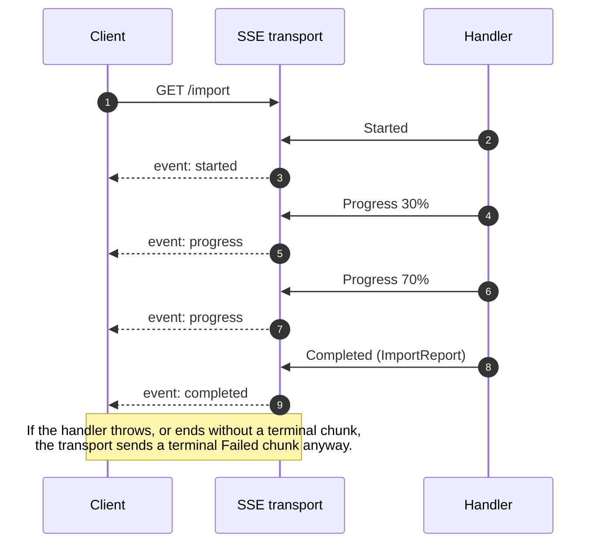
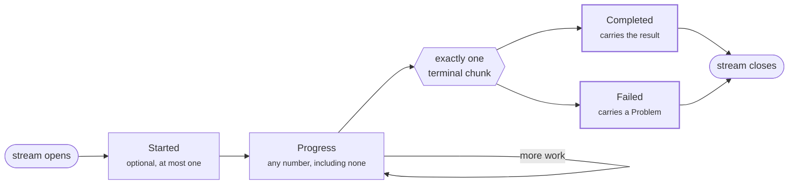

# ManagedCode.Communication

**Make failure part of the signature.** A method returns `Result<T>` — either it worked, or it carries a
`Problem` (RFC 7807) explaining why not. No invisible second return path, one error shape from the domain layer
to the HTTP response, and railway operators to chain it all without a pyramid of `try`/`catch`.

And when a command is too slow to answer in one call, [**CQRS Streaming**](#cqrs-streaming) reports its progress
as a typed stream that is guaranteed to tell you how it ended.

Built for .NET 10, with ASP.NET Core, SignalR and Orleans integration in the box.

[](https://www.nuget.org/packages/ManagedCode.Communication/)
[](https://opensource.org/licenses/MIT)
[](https://dotnet.microsoft.com/)

## Overview

### Failure is part of the signature

A method that can fail says so in its return type, and every failure is the same shape — an RFC 7807 `Problem`.

```csharp
public async Task<Result<Order>> PlaceOrderAsync(Cart cart)
{
    // A plain Result widens to Result<Order>, so a guard clause never repeats the type parameter.
    if (cart.IsEmpty)
        return Result.FailValidation(("cart", "is empty"));

    Result<Payment> payment = await ChargeAsync(cart.Total);

    // A Problem widens too, so an upstream failure is passed along without being rewrapped.
    if (payment.IsFailed)
        return payment.Problem!;

    Order order = await CreateOrderAsync(cart);
    return Result.Succeed(order);
}
```

The success has three equivalent spellings — take whichever reads best:

```csharp
return Result.Succeed(order);          // T is inferred
return Result<Order>.Succeed(order);   // spelled out
return order;                          // a bare value widens to a success
```

Only *failures* widen from the non-generic side. A `Result` carries no value, so converting a **successful**
`Result` to `Result<Order>` would have to invent one — it yields a failure instead. Build a success from its
value, never from a valueless `Result`.

### Compose instead of nesting

Every operator runs only on success and passes a failure straight through, so the happy path reads top to
bottom with no `try`/`catch` and no null checks in between. Sync or async, the chain never has to be broken by
an `await`.

```csharp
var receipt = await LoadCartAsync(cartId)
    .EnsureAsync(cart => !cart.IsEmpty, Problem.Validation(("cart", "is empty")))
    .BindAsync(cart => ChargeAsync(cart.Total))
    .Map(payment => payment.Receipt)
    .TapAsync(receipt => logger.Issued(receipt))
    .CompensateAsync(problem => RetryOnce(problem));
```

### Long-running commands are streams, not polling

A command too slow to answer in one call reports typed progress and a typed answer, and is guaranteed to tell
you how it ended. Server-Sent Events on the wire; the same contract over SignalR, Orleans or gRPC.

```csharp
// server
app.MapGet("/import", (CancellationToken ct) =>
        CqrsStream.Create<ImportProgress, ImportReport>(async writer =>
        {
            for (var i = 1; i <= 10; i++)
                await writer.ProgressAsync(new ImportProgress(i * 10));

            return Result<ImportReport>.Succeed(new ImportReport(10));
        }, ct))
    .WithCommunicationCqrsResults();
```

The client never writes the loop. Progress arrives through a callback, the answer comes back from the method,
and nothing blocks:

```csharp
Result<ImportReport> report = await http
    .GetForCqrsStreamAsync<ImportProgress, ImportReport>("/import")
    .ToResultAsync(progress => Console.WriteLine($"{progress.Percent}%"));
```

A stream that breaks, or ends without saying how it went, comes back as an ordinary failed `Result` — so it
joins the same railway as everything else:

```csharp
var imported = await http
    .GetForCqrsStreamAsync<ImportProgress, ImportReport>("/import")
    .ToResultAsync(progress => logger.Progress(progress.Percent))
    .Map(report => report.Imported)
    .CompensateAsync(problem => Result<int>.Succeed(0));
```

### It maps itself to HTTP

Return a `Result<T>` from an action and the filter turns it into a `200` or an RFC 7807 problem response. No
plumbing in the controller, and the status code comes from the `Problem` rather than from a guess.

```csharp
[HttpGet("{id}")]
public Task<Result<Order>> Get(string id) => _orders.FindAsync(id);
```

### Why this rather than the alternatives

| | What you would otherwise write |
| --- | --- |
| Throwing for expected failures | A `try`/`catch` at every layer, and a reviewer who cannot tell from a signature what might come out of it. |
| A hand-rolled `Result` type | The type is the easy part. The railway operators, RFC 7807 mapping, ASP.NET Core and Orleans integration, and the JSON contract are not. |
| Polling a status endpoint | A jobs table, a status enum, an expiry policy, and a client loop that is always either too slow or too chatty. |
| Raw WebSocket or SignalR messages | Your own envelope, your own "it's finished" signal, your own error frame — and both ends agreeing on all three. |

It is also small where it matters: `Result` and `Result<T>` are structs, so a success allocates nothing, and the
serialization path is hand-written rather than reflective — see [Performance](#performance).


## Table of Contents

- [Overview](#overview)
- [Why a Result type?](#why-a-result-type)
- [Key Features](#key-features)
- [Installation](#installation)
- [Logging Configuration](#logging-configuration)
- [Core Concepts](#core-concepts)
- [Quick Start](#quick-start)
- [CQRS Streaming](#cqrs-streaming)
- [Railway-Oriented Programming](#railway-oriented-programming)
- [Command Pattern and Idempotency](#command-pattern-and-idempotency)
  - [Command Correlation and Tracing Identifiers](#command-correlation-and-tracing-identifiers)
  - [Idempotency Architecture Overview](#idempotency-architecture-overview)
- [Error Handling Patterns](#error-handling-patterns)
- [Integration Guides](#integration-guides)
- [Performance](#performance)
- [Registration Reference](#registration-reference)
- [Observability](#observability)
- [Behaviour Notes](#behaviour-notes)
- [Comparison](#comparison)
- [Best Practices](#best-practices)

## Why a Result type?

An exception is an invisible second return path. Nothing in `Task<Order> PlaceOrderAsync(Cart cart)` tells you it
can fail with `PaymentDeclinedException`, so callers guard against what they happen to remember. `Task<Result<Order>>`
says it up front, and the compiler carries that fact everywhere the value goes.

What you get:

- **Failures are in the signature.** A reviewer sees which calls can fail without reading their implementations.
- **One error shape end to end.** Every failure is a `Problem` (RFC 7807), so a domain rule, a validation error and
  a crashed dependency all serialize the same way and map to the same HTTP response.
- **Composition instead of nesting.** Railway operators chain the happy path and short-circuit on the first
  failure, replacing pyramids of `try`/`catch`.
- **Cheap success.** `Result` and `Result<T>` are structs; a successful call allocates nothing. Exceptions are only
  costly when thrown — the point here is the clarity, and not paying stack-capture cost for *expected* failures
  like "not found" or "invalid input".
- **Straightforward tests.** Assert on a returned value rather than on which exception escaped.

What it does **not** give you: the compiler will not force you to inspect a `Result`. C# has no enforcement for
that, and this library ships no analyzer. Ignoring a returned `Result` compiles cleanly — treat that the way you
treat any ignored return value.

Exceptions are still the right tool for genuinely exceptional, unrecoverable conditions. Results are for the
failures your callers are expected to handle.

## Key Features

### 🎯 Core Result Types

- **`Result`**: Represents success/failure without a value
- **`Result<T>`**: Represents success with value `T` or failure
- **`CollectionResult<T>`**: Represents collections with built-in pagination
- **`Problem`**: RFC 7807 compliant error details

### 📡 CQRS Streaming

- A long-running command is an `IAsyncEnumerable<CqrsStreamChunk<TProgress, TResult>>` — typed progress, typed
  answer, one terminal chunk guaranteed.
- Travels over Server-Sent Events out of the box, so any client can read it without a client library.
- A handler that throws, or ends early, still produces a terminal `Failed` chunk instead of a dead connection.
- The same contract over SignalR, Orleans or gRPC — `CqrsStream.Normalize` on the server, and nothing at all on
  the client: `ToResultAsync` applies the guarantees itself.
- `ToResultAsync(onProgress)` drains a stream to its answer, so callers never write the loop — and the result
  feeds straight into the railway.
- See [CQRS Streaming](#cqrs-streaming).

### ⚙️ Static Factory Abstractions

- Leverage C# static interface members to centralize factory overloads for every result, command, and collection type.
- `IResultFactory<T>` and `ICommandFactory<T>` deliver a consistent surface while bridge helpers remove repetitive boilerplate.
- Extending the library now only requires implementing the minimal `Succeed`/`Fail` contract—the shared helpers provide the rest.

### 🧭 Pagination Utilities

- `PaginationRequest` encapsulates skip/take semantics, built-in normalization, and clamping helpers.
- `PaginationOptions` lets you define default, minimum, and maximum page sizes for a bounded API surface.
- `PaginationCommand` captures pagination intent as a first-class command with generated overloads for skip/take, page numbers, and enum command types.
- `CollectionResult<T>.Succeed(..., PaginationRequest request, int totalItems)` keeps result metadata aligned with pagination commands.

### 🚂 Railway-Oriented Programming

Complete set of functional combinators for composing operations:

- `Map`: Transform success values
- `Bind` / `Then`: Chain Result-returning operations
- `Tap` / `Do`: Execute side effects
- `Match`: Pattern matching on success/failure
- `Compensate`: Recovery from failures
- `Merge` / `Combine`: Aggregate multiple results

### 🌐 Framework Integration

- **ASP.NET Core**: Automatic HTTP response mapping
- **SignalR**: Hub filters for real-time error handling
- **Microsoft Orleans**: Grain call filters and surrogates
- **Command Pattern**: Built-in command infrastructure with idempotency

### 🔍 Observability Built In

- Source-generated `LoggerCenter` APIs provide zero-allocation logging across ASP.NET Core filters, SignalR hubs, and command stores.
- Call sites automatically check log levels, so you only pay for the logs you emit.
- Extend logging with additional `[LoggerMessage]` partials to keep high-volume paths allocation free.

### 🛡️ Error Types

Pre-defined error categories with appropriate HTTP status codes:

- Validation errors (400 Bad Request)
- Not Found (404)
- Unauthorized (401)
- Forbidden (403)
- Internal Server Error (500)
- Custom enum-based errors

## Installation

### Which package do I need?

| Package | Contains | Depends on ASP.NET Core? |
| --- | --- | --- |
| `ManagedCode.Communication` | `Result`, `Problem`, commands, native retry/timeout/idempotency/rate limiting, telemetry, and the CQRS streaming contract | no |
| `ManagedCode.Communication.Extensions` | Railway composition (`Bind`, `Map`, `Tap`, `Then`, `Ensure`, `Match`, `Compensate`…) and `HttpClient` → `Result` helpers | no |
| `ManagedCode.Communication.AspNetCore` | MVC filters, Minimal API filter, SignalR, DI wiring, and the CQRS Server-Sent Events transport | yes |
| `ManagedCode.Communication.Orleans` | Orleans grain filters, serialization, idempotency, and the `ManagedCode.Orleans.RateLimiting` command adapter | no (Orleans) |

The two "no" packages work anywhere .NET runs — console, worker, Blazor WebAssembly, MAUI. The CQRS streaming
contract and its client live in the base package on purpose: both ends of a stream need the same chunk type, and
it costs nothing to carry (`System.Net.ServerSentEvents`, `System.Net.Http.Json` and `System.Threading.Channels`
all ship in the .NET runtime, so the base package still has no extra NuGet dependency).

`ManagedCode.Communication.AspNetCore` pulls in `.Extensions` transitively, so a web application only needs that
one reference.


### Package Manager Console

```powershell
# Core library
Install-Package ManagedCode.Communication

# ASP.NET Core integration
Install-Package ManagedCode.Communication.AspNetCore

# Minimal API extensions
Install-Package ManagedCode.Communication.Extensions

# Orleans integration
Install-Package ManagedCode.Communication.Orleans
```

### .NET CLI

```bash
# Core library
dotnet add package ManagedCode.Communication

# ASP.NET Core integration
dotnet add package ManagedCode.Communication.AspNetCore

# Minimal API extensions
dotnet add package ManagedCode.Communication.Extensions

# Orleans integration
dotnet add package ManagedCode.Communication.Orleans
```

### PackageReference

```xml
<PackageReference Include="ManagedCode.Communication" Version="10.1.1" />
<PackageReference Include="ManagedCode.Communication.AspNetCore" Version="10.1.1" />
<PackageReference Include="ManagedCode.Communication.Extensions" Version="10.1.1" />
<PackageReference Include="ManagedCode.Communication.Orleans" Version="10.1.1" />
```

## Logging Configuration

The library includes integrated logging for error scenarios. Configure logging to capture detailed error information:

### ASP.NET Core Setup

```csharp
var builder = WebApplication.CreateBuilder(args);

// Add your logging configuration
builder.Logging.AddConsole();
builder.Logging.AddDebug();

// Register other services
builder.Services.AddControllers();

// Configure Communication library - this enables automatic error logging
builder.Services.ConfigureCommunication();

var app = builder.Build();
```

### Minimal API Result Mapping

Add the optional `ManagedCode.Communication.Extensions` package to bridge Minimal API endpoints with the Result pattern. The
package provides the `ResultEndpointFilter` and a fluent helper `WithCommunicationResults` that wraps the endpoint builder and
returns `IResult` instances automatically:

```csharp
var builder = WebApplication.CreateBuilder(args);

builder.Services.ConfigureCommunication();

var app = builder.Build();

// Apply the filter to a single endpoint
app.MapGet("/orders/{id}", async (Guid id, IOrderService orders) =>
        await orders.GetAsync(id))
   .WithCommunicationResults();

// Or apply it to a group so every route inherits the conversion
app.MapGroup("/orders")
   .WithCommunicationResults()
   .MapPost(string.Empty, async (CreateOrder command, IOrderService orders) =>
        await orders.CreateAsync(command));

app.Run();
```

Handlers can return any `Result` or `Result<T>` instance and the filter will reuse the existing ASP.NET Core converters so
you do not need to write manual `IResult` translations.

### Native Command Execution

Reliability is part of `ICommand` execution rather than a separate request or pipeline abstraction. Configure the runtime
once and execute either a raw-value handler or a handler that already returns `Result<T>`:

```csharp
using ManagedCode.Communication.Commands;
using ManagedCode.Communication.Commands.Execution;

var options = new CommandExecutionOptions();
options.Retry.Enabled = true;
options.Retry.MaxRetries = 3;
options.Retry.Delay = TimeSpan.FromMilliseconds(200);
options.Timeout.Timeout = TimeSpan.FromSeconds(15);

var execution = new CommandExecutionRuntime(options);
var command = Command.From("payment.capture", new CapturePayment(paymentId));

// A raw Task<Payment> is wrapped into Result<Payment>.
Result<Payment> payment = await CommandExecutor.ExecuteAsync(
    command,
    (current, cancellationToken) =>
        paymentHandler.HandleAsync(current, cancellationToken),
    execution,
    cancellationToken);

// An existing Result<Payment> is preserved, not wrapped as Result<Result<Payment>>.
Result<Payment> preserved = await Result<Payment>.ExecuteAsync(
    command,
    (current, cancellationToken) =>
        resultPaymentHandler.HandleAsync(current, cancellationToken),
    execution,
    cancellationToken);
```

`Task` and `ValueTask` overloads are available for handlers with and without values. Retry decisions are explicit through
`Retry.ShouldRetry` and `Retry.ShouldRetryException`; caller cancellation is never retried. Timeout covers idempotency waits,
retry delays, rate-limit queues, and handler execution. A final failed result is cached by the configured idempotency store,
so the same `CommandId` cannot perform the side effect twice.

For dependency injection, register the executor and the local idempotency store:

```csharp
services.AddCommandIdempotency();
services.AddCommandExecution(options =>
{
    options.Retry.Enabled = true;
    options.Timeout.Timeout = TimeSpan.FromSeconds(15);
});

var executor = serviceProvider.GetRequiredService<ICommandExecutor>();
```

Local partitions use `System.Threading.RateLimiting`:

```csharp
var limiter = PartitionedCommandRateLimiter.CreateFixedWindow(
    command => command.UserId ?? "anonymous",
    permitLimit: 100,
    window: TimeSpan.FromMinutes(1),
    queueLimit: 20);

services.AddCommandRateLimiter(limiter);
```

For a cluster-wide limit, `UseOrleansCommunication()` registers `OrleansCommandRateLimiter`. It maps command user, session,
tenant, role, IP, resource, tags, and policy name into `ManagedCode.Orleans.RateLimiting`; that package owns the distributed
grain algorithms and durable leases:

```csharp
siloBuilder.UseOrleansCommunication(options =>
    options.PolicyName = static _ => "commands");

siloBuilder.Services.AddFixedWindowRateLimiterOptions("tenant-commands", options =>
{
    options.PermitLimit = 1_000;
    options.Window = TimeSpan.FromMinutes(1);
    options.QueueLimit = 100;
});
siloBuilder.Services.AddOrleansRequestRateLimiting(options =>
    options.AddTenant("tenant-commands", required: true));
```

Command execution emits OpenTelemetry-compatible `ActivitySource` and `Meter` signals automatically. Subscribe to
`CommunicationTelemetry.SourceName` to collect total and per-attempt duration, retries, exhaustion, timeouts, queued/rejected
rate limits, final failures, and correlation tags.

### Resilient HTTP Clients

The extensions package turns HTTP responses into `Result` instances. Pass a command and execution runtime when the request
should use the native retry, timeout, idempotency, rate-limit, and telemetry behaviors:

```csharp
using ManagedCode.Communication.Extensions.Http;

Result<OrderDto> result = await httpClient.SendForResultAsync<OrderDto, Command<OrderQuery>>(
    command,
    current => new HttpRequestMessage(HttpMethod.Get, $"/orders/{current.Value.OrderId}"),
    execution,
    cancellationToken);

if (result.IsSuccess)
{
    // access result.Value without manually reading the HTTP payload
}

// Keep the same transport and RFC 7807 handling for a non-JSON success body.
var download = await httpClient.SendForResultAsync(
    () => new HttpRequestMessage(HttpMethod.Get, $"/orders/{orderId}/invoice"),
    static async (response, cancellationToken) =>
        await response.Content.ReadAsByteArrayAsync(cancellationToken));
```

The helpers use the existing `HttpResponseMessage` converters. A successful response carries the raw JSON payload
emitted by `WithCommunicationResults()`; serialized `Result<T>` envelopes are rejected. Non-success RFC 7807 responses
are deserialized back into `Problem`, preserving `type`, `title`, `detail`, `instance`, and extension members. Plain-text
error bodies remain supported when the remote endpoint does not implement RFC 7807.
Connection failures and client-side timeouts become failed results with `503` and `504`; explicit caller cancellation
still propagates `OperationCanceledException`.
Endpoint-filter success responses map to `200 OK`/`204 No Content` while failures become RFC 7807 problem details. Native `Microsoft.AspNetCore.Http.IResult`
responses pass through unchanged, so you can mix and match traditional Minimal API patterns with ManagedCode.Communication results.

### Console Application Setup

```csharp
var services = new ServiceCollection();

// Add logging
services.AddLogging(builder => 
{
    builder.AddConsole()
           .SetMinimumLevel(LogLevel.Information);
});

// Configure Communication library
services.ConfigureCommunication();

var serviceProvider = services.BuildServiceProvider();
```

The library automatically logs errors in Result factory methods (`From`, `Try`, etc.) with detailed context including file names, line numbers, and method names for easier debugging.

## Core Concepts

### Result Type

The `Result` type represents an operation that can either succeed or fail:

```csharp
public struct Result
{
    public bool IsSuccess { get; }
    public Problem? Problem { get; }
}
```

### Result Type with Value

The generic `Result<T>` includes a value on success:

```csharp
public struct Result<T>
{
    public bool IsSuccess { get; }
    public T? Value { get; }
    public Problem? Problem { get; }
}
```

### Problem Type

Implements RFC 7807 Problem Details for HTTP APIs:

```csharp
public class Problem
{
    public string Type { get; set; }
    public string Title { get; set; }
    public int StatusCode { get; set; }
    public string Detail { get; set; }
    public Dictionary<string, object> Extensions { get; set; }
}
```

### Display Message Helpers

Use built-in helpers to convert technical `Problem` payloads into UI-friendly messages:

```csharp
var problem = Problem.Create("RegistrationUnavailable", "Service is temporarily unavailable", 503);
problem.ErrorCode = "RegistrationUnavailable";

// Default message resolution chain:
// ErrorCode mapper -> Detail -> Title -> defaultMessage -> "An error occurred"
var message = problem.ToDisplayMessage(defaultMessage: "Please try again later");

var registrationMessages = new Dictionary<string, string>
{
    ["RegistrationUnavailable"] = "Registration is currently unavailable.",
    ["RegistrationBlocked"] = "Registration is temporarily blocked.",
    ["RegistrationInviteRequired"] = "Registration requires an invitation code."
};

// 1) Dictionary overload
var byDictionary = problem.ToDisplayMessage(
    registrationMessages,
    defaultMessage: "Please try again later");

// 2) Tuple mappings overload
var byTuples = problem.ToDisplayMessage(
    "Please try again later",
    ("RegistrationUnavailable", "Registration is currently unavailable."),
    ("RegistrationBlocked", "Registration is temporarily blocked."),
    ("RegistrationInviteRequired", "Registration requires an invitation code."));

// 3) Delegate overload
static string? ResolveRegistrationMessage(string code) => code switch
{
    "RegistrationUnavailable" => "Registration is currently unavailable.",
    "RegistrationBlocked" => "Registration is temporarily blocked.",
    "RegistrationInviteRequired" => "Registration requires an invitation code.",
    _ => null
};

var byDelegate = problem.ToDisplayMessage(
    ResolveRegistrationMessage,
    defaultMessage: "Please try again later");

// The same overloads are available for Result, Result<T> and CollectionResult<T>
var resultMessage = Result.Fail(problem).ToDisplayMessage(
    registrationMessages,
    defaultMessage: "Please try again later");

// Typed extension access
if (problem.TryGetExtension("retryAfter", out int retryAfterSeconds))
{
    Console.WriteLine($"Retry after: {retryAfterSeconds}s");
}
```

## Quick Start

### Basic Usage

```csharp
using ManagedCode.Communication;

// Creating Results
var success = Result.Succeed();
var failure = Result.Fail("Operation failed");

// Results with values
var userResult = Result<User>.Succeed(new User { Id = 1, Name = "John" });
var notFound = Result<User>.FailNotFound("User not found");

// Validation errors
var invalid = Result.FailValidation(
    ("email", "Email is required"),
    ("age", "Age must be positive")
);

// From something that throws — no try/catch of your own
Result<int> parsed = Result.Try(() => int.Parse(input));
Result written = await Result.TryAsync(() => File.WriteAllTextAsync(path, text));

// The exception becomes the Problem, with 500 by default; pass a status to override it.
Result<int> asBadRequest = Result.Try(() => int.Parse(input), HttpStatusCode.BadRequest);
```

`Result.Try` and `Result.TryAsync` run the delegate, return its value on success, and turn a thrown exception
into a failure — `Result.Fail(ex)` is there for when you are already inside a `catch`.

### Checking Result State

```csharp
if (result.IsSuccess)
{
    // Handle success
}

if (result.IsFailed)
{
    // Handle failure
}

if (result.IsInvalid)
{
    // Handle validation errors
}

// Pattern matching
result.Match(
    onSuccess: () => Console.WriteLine("Success!"),
    onFailure: problem => Console.WriteLine($"Failed: {problem.Detail}")
);
```

## CQRS Streaming

Some commands do not finish quickly. An import, a report, a bulk migration — the caller needs to know that it
started, roughly where it got to, and how it ended. The usual answers are all unsatisfying: poll a status
endpoint, invent a jobs table, or push raw WebSocket frames and hand-roll the protocol at both ends.

This models the whole thing as one typed stream:

```csharp
IAsyncEnumerable<CqrsStreamChunk<ImportProgress, ImportReport>>
```

Two type parameters: what progress looks like, and what the answer looks like. The stream emits any number of
progress chunks and ends with **exactly one** terminal chunk — completed or failed, never silence.



Over HTTP it travels as Server-Sent Events, so a browser, `curl` or any non-.NET client can read it with no
client library at all. The same stream works over SignalR, Orleans or gRPC without changing the handler.

### Why not just poll, or use raw WebSockets?

| | What you end up writing |
| --- | --- |
| Polling a status endpoint | A jobs table, a status enum, an expiry policy, and a client loop that is always either too slow or too chatty. |
| Raw WebSockets / SignalR messages | Your own message envelope, your own "it's finished" signal, your own error frame — and both ends have to agree on all three. |
| **This** | A typed stream. The envelope, the terminal guarantee and the error frame are the contract. |

### The chunk contract

A chunk is one of four kinds, and the transport guarantees the shape of the sequence:



- `Started` — optional, announces that execution began.
- `Progress` — optional, any number of in-flight updates.
- `Completed` — terminal success; the payload is in `Final`.
- `Failed` — terminal failure; a `Problem` says what went wrong.

What the transport guarantees on **both** ends:

- **Every stream ends on a terminal chunk.** A handler that returns without one gets a `Failed` chunk carrying
  `CqrsStreamProblems.IncompleteStream` appended, rather than the stream just stopping.
- **An unhandled exception becomes a terminal `Failed` chunk** with a `Problem` built from it, instead of
  tearing down the connection mid-response.
- **Every chunk is numbered.** `Sequence` is filled in when a handler omits it and is written to the SSE `id:`
  field, so consumers can restore ordering and resume with `Last-Event-ID`.
- **`Kind` travels as a string**, so adding enum members never renumbers existing ones across independently
  deployed clients and servers.

An exception thrown *before* the handler returns its stream never produced a stream, so it is not the
transport's to handle — it flows into the host's normal exception handling.

### Writing a handler

`CqrsStream.Create` numbers the chunks, guarantees the terminal chunk, and turns a thrown exception into a
`Failed` chunk:

```csharp
app.MapGet("/import", (CancellationToken cancellationToken) =>
        CqrsStream.Create<ImportProgress, ImportReport>(async writer =>
        {
            await writer.StartedAsync(new ImportProgress(0));

            for (var i = 1; i <= 10; i++)
            {
                await DoWorkAsync(writer.CancellationToken);
                await writer.ProgressAsync(new ImportProgress(i * 10));
            }

            return Result<ImportReport>.Succeed(new ImportReport(10));
        }, cancellationToken))
    .WithCommunicationCqrsResults();
```

Returning a failed `Result<TResult>` reports a business failure; throwing reports an unexpected one. Both arrive
as a terminal `Failed` chunk, so the consumer has a single code path for "it did not work".

You can hand-write the iterator instead when you want full control:

```csharp
static async IAsyncEnumerable<CqrsStreamChunk<ImportProgress, ImportReport>> ImportAsync()
{
    yield return CqrsStreamChunk<ImportProgress, ImportReport>.Started(new ImportProgress(0));
    await Task.Delay(100);
    yield return CqrsStreamChunk<ImportProgress, ImportReport>.Progress(new ImportProgress(50));
    yield return CqrsStreamChunk<ImportProgress, ImportReport>.Completed(new ImportReport(10));
}
```

### Reading a stream

```csharp
await foreach (var chunk in client.GetForCqrsStreamAsync<ImportProgress, ImportReport>("/import"))
{
    if (chunk.TryGetProgress(out var progress))
        Console.WriteLine($"{progress.Percent}%");
    else if (chunk.TryGetResult(out var report))
        Console.WriteLine($"imported {report.Imported}");
    else if (chunk.TryGetProblem(out var problem))
        Console.WriteLine($"failed: {problem.Title} — {problem.Detail}");
}
```

The reader does not throw for transport problems. A non-success status code, a dropped connection and an
undecodable frame all arrive as a terminal `Failed` chunk, so that loop covers every outcome. Only cancellation
propagates, as an `OperationCanceledException`.

### Consuming a stream without writing the loop

`await foreach` is the right tool when you genuinely want to react chunk by chunk. Most callers do not — they
want the answer, and maybe a progress callback on the way. Draining by hand means a loop, a list, a branch per
chunk kind, and a decision about what a stream that simply stops means.

`ToResultAsync` is that loop, written once:

```csharp
Result<ImportReport> report = await grain.StreamAsync().ToResultAsync();
```

The terminal chunk becomes the result. A stream that ends **without** one fails with
`CqrsStreamProblems.IncompleteStream` rather than reporting a success the command never claimed, and one that
faults mid-flight fails with a `Problem` built from the exception. Only cancellation propagates.

**With progress.** Pass a callback and it fires as each update arrives — the answer still comes back from the
method:

```csharp
var report = await client
    .GetForCqrsStreamAsync<ImportProgress, ImportReport>("/import")
    .ToResultAsync(progress => hub.Clients.All.SendAsync("progress", progress.Percent));
```

The callback also comes in an awaited form, which takes the cancellation token as its second parameter:

```csharp
var report = await stream.ToResultAsync(async (progress, token) =>
    await hub.Clients.All.SendAsync("progress", progress.Percent, token));
```

Nothing here blocks, and the awaited callback finishes before the next chunk is pulled — a slow handler applies
back-pressure instead of letting chunks pile up behind it. (The token parameter is also what stops an async
lambda from binding to the `Action<TProgress>` overload and having its task silently dropped.)

**When you want the whole picture.** `ToOutcomeAsync` keeps the result, every progress payload, and every chunk:

```csharp
var outcome = await grain.StreamAsync().ToOutcomeAsync();

outcome.Chunks.Count.ShouldBe(3);
outcome.Progress.Select(p => p.Percent).ShouldBe([30, 70]);
outcome.Value!.Status.ShouldBe("done");
```

An outcome converts to its `Result<TResult>` implicitly, so it can be returned wherever a result is expected.

| | Keeps | Use when |
| --- | --- | --- |
| `ToResultAsync()` | the terminal chunk only | you want the answer |
| `ToResultAsync(onProgress)` | the terminal chunk only | you want the answer and live progress |
| `ToOutcomeAsync()` | result, progress, chunks | tests, audit logs, replaying what happened |
| `ToChunkListAsync()` | every chunk | you will interpret them yourself |
| `chunks.ToStreamResult()` | — | you already have the chunks in hand |

When one Minimal API handler must choose at runtime between a CQRS stream and another HTTP response, keep the
handler typed as `IResult` and use the same library-owned SSE transport explicitly:

```csharp
return CqrsStreamHttpResults.ServerSentEvents(updates);
```

This uses the same normalization, event names, sequence ids, and terminal-chunk guarantees as
`WithCommunicationCqrsResults()`; do not add a second SSE writer in application code.

The name says what comes back: the `To…Async` methods return the answer, `AsCqrsStream` returns a stream.

`ToResultAsync` and `ToOutcomeAsync` apply the stream guarantees themselves, so they work on a raw SignalR,
Orleans or gRPC stream with nothing in front of them — a transport that faults comes back as a failed `Result`,
not an exception. `AsCqrsStream()` is for when you want to keep iterating chunk by chunk with those same
guarantees; `ToChunkListAsync()` is the deliberate exception that hands back exactly what arrived, faults
included. See [Other transports](#other-transports).

### Streams and the railway

`ToResultAsync` returns `Task<Result<TResult>>`, which is exactly what the async railway operators take. A
stream is therefore just the start of a chain — no `await`, no temporary variable, no `if` in between:

```csharp
var imported = await client
    .GetForCqrsStreamAsync<ImportProgress, ImportReport>("/import")
    .ToResultAsync(progress => logger.Progress(progress.Percent))
    .EnsureAsync(report => report.Imported > 0, Problem.Validation(("import", "produced nothing")))
    .Map(report => report.Imported)
    .TapAsync(count => metrics.Imported(count))
    .CompensateAsync(problem => problem.StatusCode == 409
        ? Result<int>.Succeed(0)          // already imported by someone else — not an error here
        : Result<int>.Fail(problem));
```

Every step runs only on success; a failure anywhere — including the stream breaking, or ending without saying
how it went — skips the rest and arrives at `CompensateAsync` as an ordinary `Problem`.


### Registration

```csharp
builder.Services.AddCommunicationCqrs();                                    // minimal API
builder.Services.AddControllers(o => o.AddCommunicationCqrsFilters());      // MVC controllers
```

Both default to numbering chunks and guaranteeing a terminal chunk. To change that:

```csharp
// server, globally or per endpoint
builder.Services.AddCommunicationCqrs(o => o.EnsureTerminalChunk = false);
app.MapGet("/import", Handler)
   .WithCommunicationCqrsResults(new CqrsStreamServerOptions { EnsureTerminalChunk = false });

// client
var options = new CqrsStreamClientOptions
{
    MalformedChunkBehavior = CqrsMalformedChunkBehavior.Skip  // default: EmitFailedChunk; also: Throw
};
```

Two namespaces cover the feature: `ManagedCode.Communication.CQRS` for the contract, the authoring helper and
the client reader, and `ManagedCode.Communication.AspNetCore.Extensions` for the server transport. The first
lives in the base package, so a console app, a worker or a Blazor WebAssembly client can consume a stream
without referencing ASP.NET Core.

### Other transports

The guarantees come from `CqrsStream.Normalize`, which the SSE transport calls for you. Any other transport gets
the same contract by calling it directly.

```csharp
public class ImportHub : Hub
{
    public IAsyncEnumerable<CqrsStreamChunk<ImportProgress, ImportReport>> Import(CancellationToken token)
        => CqrsStream.Normalize(ImportAsync(token), cancellationToken: token);
}
```

Skipping `Normalize` is what makes the difference: a hub method that throws mid-stream faults the connection and
the client sees a `HubException` instead of a terminal chunk it can inspect. A `CqrsStream.Create` stream already
carries the guarantees and needs no `Normalize`.

**On the client there is nothing extra to remember** — a SignalR stream reads exactly like the HTTP one, in a
single call:

```csharp
var report = await hub
    .StreamAsync<CqrsStreamChunk<ImportProgress, ImportReport>>("Import", cancellationToken)
    .ToResultAsync(progress => Console.WriteLine($"{progress.Percent}%"), cancellationToken);
```

`ToResultAsync` applies the guarantees itself, so this holds even when the server does **not** normalize: a hub
method that throws part-way through, or a connection that simply drops, comes back as a failed `Result` carrying
a `Problem` rather than a `HubException` thrown out of your `await`.

When you want to keep iterating chunk by chunk instead of draining to a result, `AsCqrsStream()` applies the same
guarantees and hands the chunks back:

```csharp
await foreach (var chunk in hub
    .StreamAsync<CqrsStreamChunk<ImportProgress, ImportReport>>("Import", cancellationToken)
    .AsCqrsStream())
{
}
```

Both take an `IAsyncEnumerable<>` rather than a `HubConnection` on purpose. SignalR, Orleans and gRPC all surface
a stream as one, so a single method covers them all and this package takes a dependency on none of them.

**Orleans.** `ManagedCode.Communication.Orleans` registers a serialization surrogate for `CqrsStreamChunk<,>`,
so chunks can cross a grain boundary:

```csharp
public interface IImportGrain : IGrainWithStringKey
{
    IAsyncEnumerable<CqrsStreamChunk<ImportProgress, ImportReport>> ImportAsync();
}
```

Your own progress and result payloads still need `[GenerateSerializer]` with `[Id(n)]` members, as with any type
crossing a grain boundary. A missing serializer is a *startup* failure in Orleans, not a runtime one: a silo
whose grain interfaces mention an unserializable type refuses to boot.


## Railway-Oriented Programming

Every operator has a `Task<Result<T>>` receiver and accepts an ordinary synchronous delegate, so an async chain
never has to be broken by an `await` and a temporary variable just because one step happens not to be async.


> **Package:** `ManagedCode.Communication.Extensions`, namespace `ManagedCode.Communication.Extensions`.
> One `using` gives you the whole railway surface. ASP.NET Core applications get it transitively through
> `ManagedCode.Communication.AspNetCore`. The aggregation helpers (`Result.Merge`, `Result.MergeAll`,
> `Result.Combine`, `Result.CombineAll`) are static methods on `Result` in the core package, so combining
> results needs no extra reference.

```csharp
using ManagedCode.Communication;            // Result, Problem
using ManagedCode.Communication.Extensions; // Bind / Map / Tap / Then / Ensure / Match / Compensate / ...
```

Railway-oriented programming treats operations as a series of tracks where success continues on the main track and failures switch to an error track.

### The full surface

Most operators short-circuit on failure: once a result is failed, the step is skipped and the original `Problem`
is carried to the end. The exceptions are the ones that exist to handle failure — `Else`, `Compensate*`, `Match`,
`Switch` — and `Finally`, which runs on both branches.

| Operator | Purpose |
| --- | --- |
| `Bind` / `Then` | Run the next step, which itself returns a `Result`. **Two names for one operation** — `Bind` is the conventional ROP name, `Then` reads better in long chains. Pick one per codebase. |
| `BindAsync` / `ThenAsync` | Async form of the above. |
| `Map` / `MapAsync` | Transform the value with a plain function that cannot fail. |
| `Tap` / `TapAsync`, `Do` / `DoAsync` | Run a side effect (logging, metrics) and pass the value through unchanged. |
| `Ensure`, `Where`, `Verify`, `Check` | Fail the chain when a predicate does not hold. |
| `FailIf`, `OkIf` | Flip a result based on a predicate. |
| `Match` | Collapse to a single value by handling both branches. The usual way to leave the railway. |
| `Else` | Substitute an alternative result when the current one failed. |
| `Compensate`, `CompensateAsync`, `CompensateWith` | Recover from a failure, optionally by calling a fallback. |
| `Switch`, `SwitchFirst` | Branch on success/failure without leaving the chain. |
| `Finally` | Run an action on both branches, like a `finally` block. |
| `ToResult` | Lift a nullable value into a `Result`, failing when it is null. |

Every operator has an `…Async` form that accepts a `Task<Result>` / `Task<Result<T>>` receiver, so an
asynchronous pipeline never has to be interrupted by an `await` and a temporary variable:

```csharp
var result = await LoadUserAsync(id)
    .EnsureAsync(user => user.IsActive, Problem.Create("inactive", "User is disabled.", 403))
    .TapAsync(user => _audit.RecordAsync(user.Id))
    .BindAsync(user => LoadCartAsync(user.Id))
    .MapAsync(cart => cart.Total)
    .CompensateAsync(problem => RecoverAsync(problem))
    .MatchAsync(total => Results.Ok(total), problem => Results.Problem(problem.Detail));
```

Aggregation lives on `Result` itself in the core package, so it needs no extra reference:

| Method | Purpose |
| --- | --- |
| `Result.Merge(...)` | Succeeds when all succeed; returns the **first** failure otherwise. |
| `Result.MergeAll(...)` | Succeeds when all succeed; aggregates **every** failure otherwise. |
| `Result.Combine(...)` | Collects values into a `CollectionResult<T>`, stopping at the first failure. |
| `Result.CombineAll(...)` | Collects values, aggregating every failure. |


### Basic Chaining

```csharp
public Result<Order> ProcessOrder(int userId)
{
    return Result.From(() => GetUser(userId))
        .Then(user => ValidateUser(user))
        .Then(user => GetUserCart(user.Id))
        .Then(cart => ValidateCart(cart))
        .Then(cart => CreateOrder(cart))
        .Then(order => ProcessPayment(order))
        .Then(order => SendConfirmation(order));
}
```

### Async Operations

```csharp
public async Task<Result<Order>> ProcessOrderAsync(int userId)
{
    return await Result.From(() => GetUserAsync(userId))
        .ThenAsync(user => ValidateUserAsync(user))
        .ThenAsync(user => GetUserCartAsync(user.Id))
        .ThenAsync(cart => CreateOrderAsync(cart))
        .ThenAsync(order => ProcessPaymentAsync(order))
        .ThenAsync(order => SendConfirmationAsync(order));
}
```

### Error Recovery

```csharp
var result = await GetPrimaryService()
    .CompensateAsync(async error => 
    {
        _logger.LogWarning($"Primary service failed: {error.Detail}");
        return await GetFallbackService();
    })
    .CompensateWith(defaultValue); // Final fallback
```

### Combining Multiple Results

```csharp
// Merge: Stop at first failure
var firstFailureResult = Result.Merge(
    ValidateName(name),
    ValidateEmail(email),
    ValidateAge(age)
);

// MergeAll: aggregate all failures
var allFailuresResult = Result.MergeAll(
    ValidateName(name),
    ValidateEmail(email),
    ValidateAge(age)
);

if (allFailuresResult.TryGetProblem(out var problem))
{
    // All failures were validation failures:
    // problem.GetValidationErrors() returns merged field errors.
    //
    // Mixed failures (401/403/500/...) return aggregate problem:
    // problem.StatusCode == 500
    // problem.Extensions["errors"] contains the original Problem[] list.
}

if (allFailuresResult.TryGetProblem(out var aggregateProblem) &&
    aggregateProblem.TryGetExtension("errors", out Problem[]? originalErrors))
{
    foreach (var error in originalErrors)
    {
        Console.WriteLine($"{error.StatusCode}: {error.Title} - {error.Detail}");
    }
}

// Combine: Aggregate values
var combined = Result.Combine(
    GetUserProfile(),
    GetUserSettings(),
    GetUserPermissions()
); // Returns CollectionResult<T>

// CombineAll: aggregate failures while preserving original errors
var combinedAll = Result.CombineAll(
    GetUserProfile(),
    GetUserSettings(),
    GetUserPermissions()
);
```

## Command Pattern and Idempotency

### Command Infrastructure

The library includes built-in support for command pattern with distributed idempotency:

```csharp
// Basic command
public class CreateOrderCommand : Command<Order>
{
    public CreateOrderCommand(string orderId, Order order) 
        : base(orderId, "CreateOrder")
    {
        Value = order;
        UserId = "user123";
        CorrelationId = Guid.NewGuid().ToString();
    }
}

// Command with metadata
var command = new Command("command-id", "ProcessPayment")
{
    UserId = "user123",
    SessionId = "session456",
    CorrelationId = "correlation789",
    CausationId = "parent-command-id",
    TraceId = Activity.Current?.TraceId.ToString(),
    SpanId = Activity.Current?.SpanId.ToString()
};
```

### Pagination Commands

Pagination is now a first-class command concept that keeps factories DRY and metadata consistent:

```csharp
var options = new PaginationOptions(defaultPageSize: 25, maxPageSize: 100);
var request = PaginationRequest.Create(skip: 0, take: 0, options); // take defaults to 25

// Rich factory surface without duplicate overloads
var paginationCommand = PaginationCommand.Create(request, options)
    .WithCorrelationId(Guid.NewGuid().ToString());

// Apply to results without manually recalculating metadata
var page = CollectionResult<Order>.Succeed(orders, paginationCommand.Value!, totalItems: 275, options);

// Use enum-based command types when desired
enum PaginationCommandType { ListCustomers }
var typedCommand = PaginationCommand.Create(PaginationCommandType.ListCustomers);
```

`PaginationRequest` exposes helpers such as `Normalize`, `ClampToTotal`, and `ToSlice` to keep skip/take logic predictable. Configure bounds globally with `PaginationOptions` to protect APIs from oversized queries.

### Idempotent Command Execution

#### ASP.NET Core Idempotency

```csharp
// Register idempotency store
builder.Services.AddSingleton<ICommandIdempotencyStore, InMemoryCommandIdempotencyStore>();
// Or use Orleans-based store
builder.Services.AddSingleton<ICommandIdempotencyStore, OrleansCommandIdempotencyStore>();

// Service with idempotent operations
public class PaymentService
{
    private readonly ICommandIdempotencyStore _idempotencyStore;
    
    public async Task<Result<Payment>> ProcessPaymentAsync(ProcessPaymentCommand command)
    {
        // Automatic idempotency - returns cached result if already executed
        return await _idempotencyStore.ExecuteIdempotentAsync(
            command.Id,
            async () =>
            {
                // This code runs only once per command ID
                var payment = await _paymentGateway.ChargeAsync(command.Amount);
                await _repository.SavePaymentAsync(payment);
                return Result<Payment>.Succeed(payment);
            },
            command.Metadata
        );
    }
}
```

#### Orleans-Based Idempotency

```csharp
// Automatic idempotency with Orleans grains
public class OrderGrain : Grain, IOrderGrain
{
    private readonly ICommandIdempotencyStore _idempotencyStore;
    
    public async Task<Result<Order>> CreateOrderAsync(CreateOrderCommand command)
    {
        // Uses ICommandIdempotencyGrain internally for distributed coordination
        return await _idempotencyStore.ExecuteIdempotentAsync(
            command.Id,
            async () =>
            {
                // Guaranteed to execute only once across the cluster
                var order = new Order { /* ... */ };
                await SaveOrderAsync(order);
                return Result<Order>.Succeed(order);
            }
        );
    }
}
```

### Command Execution Status

```csharp
public enum CommandExecutionStatus
{
    NotStarted,    // Command hasn't been processed
    Processing,    // Currently being processed
    Completed,     // Successfully completed
    Failed,        // Processing failed
    Expired        // Result expired from cache
}

// Check command status
var status = await _idempotencyStore.GetCommandStatusAsync("command-id");
if (status == CommandExecutionStatus.Completed)
{
    var result = await _idempotencyStore.GetCommandResultAsync<Order>("command-id");
}
```

### Command Correlation and Tracing Identifiers

Commands implement `ICommand` and surface correlation, causation, trace, span, user, and session identifiers alongside optional metadata so every hop can attach observability context. The base `Command` and `Command<T>` types keep those properties on the
root object, and serializers/Orleans surrogates round-trip them without custom plumbing.
root object, and serializers/Orleans surrogates round-trip them without custom plumbing.

#### Identifier lifecycle
- Static command factories generate monotonic version 7 identifiers via `Guid.CreateVersion7()` and stamp a UTC timestamp so commands can be sorted chronologically even when sharded.
- Factory helpers never mutate the correlation or trace identifiers; callers opt in through fluent extension
  methods that return the same command instance, so they chain freely:

| Method | Sets |
| --- | --- |
| `WithCorrelationId(id)` | Correlation identifier shared by everything in one logical operation. |
| `WithCausationId(id)` | Identifier of the command that caused this one. |
| `WithTraceId(id)` / `WithSpanId(id)` | Distributed-tracing identifiers. |
| `WithUserId(id)` | Acting user. |
| `WithSessionId(id)` | Session the command belongs to. |
| `WithMetadata(metadata)` / `WithMetadata(m => …)` | Replaces or edits the whole `CommandMetadata`. |

Every factory generates the command id itself — a time-ordered UUIDv7 — and takes `commandId` as an **optional
trailing parameter**. Pass one only when the identity comes from outside: an idempotency key sent by the caller,
or a replayed message whose identity must be preserved.

```csharp
var command  = Command<PlaceOrder>.From(payload);                    // id generated
var replayed = Command<PlaceOrder>.From(payload, idempotencyKey);    // id supplied
```

Only the command id is generated. Correlation, causation, trace, span, user and session describe how a command
relates to the rest of the system, which the library cannot infer — they stay `null` until you set them.

Correlation, causation, trace, span, user and session identifiers live on the command itself
(`command.CorrelationId`, `command.UserId`, …); `CommandMetadata` carries the rest — priority, retries, timeout,
tags and free-form properties.

```csharp
var command = Command<PlaceOrder>.From(payload)
    .WithCorrelationId(correlationId)
    .WithCausationId(parentCommandId)
    .WithUserId(user.Id)
    .WithSessionId(session.Id)
    .WithMetadata(metadata => metadata.Priority = CommandPriority.High);
```
- Metadata mirrors the trace/span identifiers for workload-specific diagnostics without coupling transport-level identifiers to
payload annotations.

#### Field reference

| Field | Purpose | Typical source | Notes |
| --- | --- | --- | --- |
| `CommandId` | Unique, monotonic identifier for deduplication | Static command factories | Remains stable for retries and storage lookups. |
| `CorrelationId` | Ties a command to an upstream workflow/request | HTTP `X-Correlation-Id`, message headers | Preserved through
 serialization and Orleans surrogates. |
| `CausationId` | Records the predecessor command/event | Current command ID | Supports causal chains in telemetry. |
| `TraceId` | Connects to distributed tracing spans | OpenTelemetry/`Activity` context | The library stores, but never generate
s, trace identifiers. |
| `SpanId` | Identifies the originating span | OpenTelemetry/`Activity` context | Often paired with `Metadata.TraceId` for deep
er traces. |
| `UserId` / `SessionId` | Attach security/session principals | Authentication middleware | Useful for multi-tenant auditing. |

#### Trace vs. correlation
- **Correlation IDs** bundle every command spawned from a single business request. Assign them at ingress and keep the value st
able across retries so dashboards can answer “what commands ran because of this call?”.
- **Trace/Span IDs** follow distributed tracing semantics. Commands avoid creating new traces and instead persist the ambient `A
ctivity` identifiers through serialization so telemetry back-ends can stitch spans together.
- Both identifier sets are serialized together, enabling pivots between business-level correlation and technical call graphs wit
hout extra configuration.

#### Generation and propagation guidance
- Use `Command.Create(...)` / `Command<T>.Create(...)` (or the matching `From(...)` helpers) to get a version 7 identifier and U
TC timestamp automatically.
- Read or generate correlation IDs from HTTP headers or upstream messages and apply them via `.WithCorrelationId(...)` before d
ispatching commands.
- Capture `Activity.TraceId`/`Activity.SpanId` through `.WithTraceId(...)` and `.WithSpanId(...)` (and metadata counterparts) wh
en bridging to queues, Orleans, or background pipelines.
- Serialization tests verify the identifiers round-trip, so consumers can rely on receiving the same values they emitted.

#### Operational considerations
- Factory unit tests ensure commands created through the helpers carry version 7 identifiers, UTC timestamps, and derived `Comma
ndType` values for traceability.
- Idempotency regression tests assert that concurrent callers reuse cached results and propagate failures consistently, preservi
ng correlation integrity when retry storms occur.

### Idempotency Architecture Overview

#### Scope
The shared idempotency helpers (`CommandIdempotencyExtensions`), default in-memory store, and test coverage work together to pro
tect concurrency, caching, and retry behaviour across hosts.

#### Strengths
- **Deterministic status transitions.** `ExecuteIdempotentAsync` only invokes the provided delegate after atomically claiming th
e command, writes the result, and then flips the status to `Completed`, so retries either reuse cached output or wait for the in
-flight execution to finish.
- **Batch reuse of cached outputs.** Batch helpers perform bulk status/result lookups and bypass execution for already completed
 commands, even when cached results are `null` or default values.
- **Fine-grained locking in the memory store.** Per-command `SemaphoreSlim` instances eliminate global contention, and reference
 counting ensures locks are released once no callers use a key.
- **Concurrency regression tests.** Dedicated unit tests confirm that concurrent callers share a single execution, failed primar
y runs surface consistent exceptions, and the final status ends up in `Failed` when appropriate.

#### Risks & considerations
- **Missing-result ambiguity.** If a store reports `Completed` but the result entry expired, the extensions currently return the
 default value. Stores that can distinguish “missing” from “stored default” should override `TryGetCachedResultAsync` to trigger
 a re-execution.
- **Wait semantics rely on polling.** Adaptive polling keeps responsiveness reasonable, but distributed stores can swap in push-
style notifications if tail latency becomes critical.
- **Status retention policies.** The memory store’s cleanup removes status and result after a TTL; other implementations must pr
ovide similar hygiene to avoid unbounded growth while keeping enough history for retries.

#### Recommendations
1. Document store-specific retention guarantees so callers can tune retry windows.
2. Consider extending the store contract with a boolean flag (or sentinel wrapper) that differentiates cached `default` values f
rom missing entries.
3. Monitor lock-pool growth in long-lived applications and log keys that never release to diagnose misbehaving callers before me
mory pressure builds up.

## Error Handling Patterns

### Validation Pattern

```csharp
public Result<User> CreateUser(CreateUserDto dto)
{
    // Collect all validation errors
    var errors = new List<(string field, string message)>();
    
    if (string.IsNullOrEmpty(dto.Email))
        errors.Add(("email", "Email is required"));
    
    if (!dto.Email.Contains("@"))
        errors.Add(("email", "Invalid email format"));
    
    if (dto.Age < 0)
        errors.Add(("age", "Age must be positive"));
    
    if (dto.Age < 18)
        errors.Add(("age", "Must be 18 or older"));
    
    if (errors.Any())
        return Result.FailValidation(errors.ToArray());
    
    var user = new User { /* ... */ };
    return Result<User>.Succeed(user);
}
```

## Integration Guides

### ASP.NET Core Integration

```csharp
var builder = WebApplication.CreateBuilder(args);

builder.AddCommunication();                       // ShowErrorDetails = IsDevelopment
builder.Services.AddControllers(o => o.AddCommunicationFilters());
builder.Services.AddSignalR(o => o.AddCommunicationFilters());
```

An action returns a `Result<T>` directly; the filter turns it into the HTTP response:

```csharp
[HttpGet("{id}")]
public Task<Result<User>> Get(int id) => _users.FindAsync(id);
```

`AddCommunicationFilters()` registers three filters, and the order matters — use the helper rather than adding
them by hand:

| Order | Filter | What it does |
| --- | --- | --- |
| 1 | `CommunicationModelValidationFilter` | Turns ModelState errors into `Result.FailValidation` before the action runs |
| 2 | `ResultToActionResultFilter` | Maps the returned `Result<T>` to an HTTP response |
| 3 | `CommunicationExceptionFilter` | Catches anything unhandled and returns Problem Details |

Status codes come from the `Problem`: `FailNotFound` is a 404, `FailValidation` a 400, an unhandled exception a
500. See [Mapping exceptions to status codes](#mapping-exceptions-to-status-codes) to override that per type.


### SignalR Integration

```csharp
public class ChatHub : Hub
{
    public async Task<Result<MessageDto>> SendMessage(string user, string message)
    {
        if (string.IsNullOrEmpty(message))
            return Result.FailValidation(("message", "Message cannot be empty"));
        
        var messageDto = new MessageDto
        {
            User = user,
            Message = message,
            Timestamp = DateTime.UtcNow
        };
        
        await Clients.All.SendAsync("ReceiveMessage", user, message);
        return Result<MessageDto>.Succeed(messageDto);
    }
    
    public async Task<Result> JoinGroup(string groupName)
    {
        if (string.IsNullOrEmpty(groupName))
            return Result.FailValidation(("groupName", "Group name is required"));
        
        await Groups.AddToGroupAsync(Context.ConnectionId, groupName);
        return Result.Succeed();
    }
}
```

### Microsoft Orleans Integration

```csharp
// silo
silo.UseLocalhostClustering().UseOrleansCommunication();

// client
client.UseOrleansCommunication();
```

`UseOrleansCommunication()` is required — without it a silo whose grain interfaces mention a `Result` refuses to
start, because Orleans validates serializers at boot. It registers surrogates for `Result`, `Result<T>`,
`CollectionResult<T>`, `Problem` and `CqrsStreamChunk<,>`, and adds a call filter that converts an exception
thrown by a grain into a failed result — logging the original exception first, so the stack trace still reaches
your traces.

A grain then returns results like anything else:

```csharp
public interface IUserGrain : IGrainWithStringKey
{
    Task<Result<UserState>> GetStateAsync();
    Task<CollectionResult<Activity>> GetActivitiesAsync(int page, int pageSize);
}
```

Your own payload types still need `[GenerateSerializer]` with `[Id(n)]` members, as with any type crossing a
grain boundary.


## Performance

### Keeping results cheap

1. **Use structs**: `Result` and `Result<T>` are value types (structs), so a success carries no heap allocation
2. **Avoid boxing**: Use generic methods to prevent boxing of value types
3. **Chain operations**: Use railway-oriented programming to avoid intermediate variables
4. **Async properly**: Use `ConfigureAwait(false)` in library code
5. **Build problems per failure, do not share them**: `Problem` is mutable — it has settable properties and an
   `Extensions` dictionary that `AddValidationError` writes into. A shared static instance can be mutated by any
   caller that touches it, poisoning every later use. Create one per failure, or use a factory method.
6. **Prefer the `CancellationToken` overloads** of the idempotency helpers. `Func<Task<T>>` cannot observe
   cancellation, so a timeout or a cancelled caller has to wait for the operation to finish on its own.

### Serialization cost

`Result`, `Result<T>` and `CqrsStreamChunk<,>` carry hand-written `System.Text.Json` converters, attached to the
types themselves — you get them with any `JsonSerializerOptions`, without registering anything. They exist
because the default path is expensive for these shapes: a struct mixing `init`-only members with a private
`[JsonInclude]` field pushes `System.Text.Json` onto a reflection-driven path.

What the transport costs, separated from what your payload costs. Measured with
`GC.GetAllocatedBytesForCurrentThread`, on a progress chunk carrying a ten-character string:

| | Allocated |
| --- | --- |
| `Result<T>`, over the payload it wraps | ~24 B |
| The chunk object itself | 136 B |
| Serializing a chunk | 128 B |
| A progress chunk on the wire | 103 B |

Deserializing a whole chunk is those fixed costs plus the payload, and the payload is usually the larger half:

| Payload declared as | Chunk deserializes in | of which payload |
| --- | --- | --- |
| `class Progress { public string? State { get; init; } }` | 232 B | 120 B |
| `record Progress(string State)` | 336 B | 224 B |

`CollectionResult<T>` needs no converter — it has no private serialized field, so the default path costs it only
~56 bytes over the items themselves.

On the client, chunks are deserialized straight from each frame's UTF-8 bytes rather than from a string per
frame, and the JSON contract is resolved once per stream instead of once per frame. Reading a 20 000-frame
stream end to end costs about 292 bytes per frame — and `ToResultAsync` costs the same as the raw
`await foreach`, because the stream guarantees are one wrapper per stream, not per chunk.

A chunk carries no timestamp. Ordering comes from `sequence`, which the transport always fills in and which the
SSE `id:` field is derived from; a per-chunk clock reading was roughly a third of every progress frame spent on
something nothing read.

`ManagedCode.Communication.Tests/Results/SerializationAllocationTests.cs` holds budgets for all of this, so a
regression fails the build rather than going unnoticed.

#### The payload shape is worth more than everything above

`System.Text.Json` populates a type with a parameterized constructor through a different, allocating path than
one it can fill property by property. The two declarations below are equally immutable, and the positional one
costs 104 bytes more per object:

| Payload declared as | Allocated |
| --- | --- |
| `record Progress(string State)` | 224 B |
| `record Progress { public string? State { get; init; } }` | 120 B |
| `class Progress { public string? State { get; init; } }` | 120 B |

At a thousand chunks a second that is 100 KB/s of pure garbage. If the type is not yours to reshape, hand its
source-generated contract to the transport instead:

```csharp
[JsonSerializable(typeof(Progress))]
internal partial class StreamPayloads : JsonSerializerContext;

var options = new CqrsStreamClientOptions
{
    JsonSerializerOptions = CqrsStreamSerialization.WithPayloadContext(StreamPayloads.Default)
};
```

`WithPayloadContext` consults your context first and falls back to reflection for everything else, the
transport's own types included — pointing `TypeInfoResolver` straight at your context would leave
`CqrsStreamChunk<,>` without a contract and fail on the first chunk. The wire format is unchanged, so one end
may use a context and the other not. On the server, add the same context to `ConfigureHttpJsonOptions`.


## Behaviour Notes

Things that surprise people, gathered in one place.

### `Problem` is mutable

`Problem` has settable properties and a live `Extensions` dictionary. Treat every instance as owned by one
failure. Do not cache a shared instance in a `static` field: `AddValidationError`, `ErrorCode` and the property
setters all mutate in place, so one caller can change what every later caller sees.

### Exception-to-status mapping is a heuristic

`HttpStatusCodeHelper.GetStatusCodeForException` classifies common exception types. It cannot know your domain,
so register overrides at startup with `ExceptionStatusCodeMap` — see
[Mapping exceptions to status codes](#mapping-exceptions-to-status-codes).

### Results are immutable once built

`Result<T>.Value` and the `CollectionResult<T>` members are `init`-only. Build results through `Succeed` / `Fail`;
serializers can still populate them.

### HTTP status vs. command outcome

A failed command reported over CQRS streaming still arrives on a `200 OK` response — the HTTP exchange
succeeded, the command did not. Inspect the terminal chunk, not the status code. A non-2xx status means the
request never reached the handler.

## Registration Reference

### Nothing is required

Every part of the library works with **no registration at all** — no container, no logger, no OpenTelemetry.
`Result`, `Problem`, railway operators, the CQRS contract and its HTTP client are plain types you can `new` up in
a console app or a unit test.

If you never call `CommunicationLogger.Configure`, logging falls back to an internal factory that writes nowhere
and throws nothing. If you never subscribe to `CommunicationTelemetry.SourceName`, recording a failure is a
couple of null checks. Registration turns signals *on*; it is never a precondition for correctness.

### What each entry point does

**Core** (`ManagedCode.Communication`)

| Call | Effect |
| --- | --- |
| `services.ConfigureCommunication(loggerFactory)` | Points the library's internal logger at your factory. Optional. |
| `CommunicationLogger.Configure(serviceProvider \| loggerFactory)` | Same, without a service collection. Optional. |
| `ExceptionStatusCodeMap.Map<TException>(status)` | Overrides the exception-to-status mapping. Call once at startup. |

**Commands and idempotency** (`ManagedCode.Communication`)

| Call | Effect |
| --- | --- |
| `services.AddCommandIdempotency()` | In-memory store plus the background cleanup service. |
| `services.AddCommandIdempotency<TStore>()` | Your own `ICommandIdempotencyStore`, with cleanup. |
| `services.AddCommandIdempotencyStore<TStore>()` | Store only, no background service. |
| `services.AddCommandIdempotencyWithManualCleanup<TStore>()` | Store plus cleanup you trigger yourself. |

**ASP.NET Core** (`ManagedCode.Communication.AspNetCore`)

| Call | Effect |
| --- | --- |
| `services.AddCommunication(options)` | Logging plus the MVC filters. The usual one-liner. |
| `services.AddCommunicationAspNetCore([loggerFactory])` | Logging only. |
| `services.AddCommunicationFilters()` | MVC filters only: exception handling, model validation, `Result` → status code. |
| `services.AddControllers(o => o.AddCommunicationFilters())` | Same, applied directly to `MvcOptions`. |
| `app.UseCommunication()` | Middleware for request-scoped handling. |
| `services.AddCommunicationCqrs([options])` | CQRS Server-Sent Events transport plus `CqrsStreamServerOptions`. |
| `services.AddControllers(o => o.AddCommunicationCqrsFilters())` | CQRS MVC filter only. |
| `endpoint.WithCommunicationResults()` | Minimal API: map a returned `Result` to an HTTP response. |
| `endpoint.WithCommunicationCqrsResults([options])` | Minimal API: render a chunk stream as SSE. |
| `services.AddSignalR(o => o.AddCommunicationHubFilter())` | Hub filter turning hub exceptions into failed results. |

**Orleans** (`ManagedCode.Communication.Orleans`)

| Call | Effect |
| --- | --- |
| `siloBuilder.UseOrleansCommunication()` | Grain call filters and the serialization surrogates. |
| `clientBuilder.UseOrleansCommunication()` | The client-side half of the same. |

**Observability** — see [Observability](#observability):

```csharp
builder.Services.AddOpenTelemetry()
    .WithTracing(t => t.AddSource(CommunicationTelemetry.SourceName))
    .WithMetrics(m => m.AddMeter(CommunicationTelemetry.SourceName));
```

### A typical web application

```csharp
var builder = WebApplication.CreateBuilder(args);

builder.Services.AddCommunication();        // logging + MVC filters
builder.Services.AddCommunicationCqrs();    // only if you stream commands
builder.Services.AddCommandIdempotency();   // only if you need idempotent commands

builder.Services.AddOpenTelemetry()         // only if you collect telemetry
    .WithTracing(t => t.AddSource(CommunicationTelemetry.SourceName))
    .WithMetrics(m => m.AddMeter(CommunicationTelemetry.SourceName));

var app = builder.Build();
app.UseCommunication();
app.MapControllers();
app.Run();
```

Drop any line you do not need — none of them are load-bearing for the rest.

## Observability

### OpenTelemetry

Failures are reported through `System.Diagnostics.ActivitySource` and `System.Diagnostics.Metrics.Meter`, both of
which ship with .NET — the library takes **no dependency on the OpenTelemetry SDK**. Subscribe to the source and
the signals appear; subscribe to nothing and recording costs a couple of null checks.

```csharp
builder.Services.AddOpenTelemetry()
    .WithTracing(tracing => tracing.AddSource(CommunicationTelemetry.SourceName))
    .WithMetrics(metrics => metrics.AddMeter(CommunicationTelemetry.SourceName));
```

| Signal | Name | Notes |
| --- | --- | --- |
| Traces | `ManagedCode.Communication` | Failed operations set the span status to `Error` and tag it with `error.type`, `problem.type`, `problem.title`, `problem.status`, `problem.error_code`. |
| Metric | `communication.result.failures` | Counter of failed results, tagged by `error.type` and `problem.status`. |
| Metric | `communication.exceptions` | Counter of exceptions converted into a `Problem`. |

### Recording the real error

A `Problem` built from an exception keeps only the exception's type name and message — **the stack trace and any
inner exceptions are gone**. Pass the exception itself so it reaches the trace as a proper exception event:

```csharp
catch (Exception exception)
{
    var problem = Problem.Create(exception);
    CommunicationDiagnostics.ReportFailure(logger, problem, exception); // logs + traces, stack trace included
    return Result<Order>.Fail(problem);
}
```

The ASP.NET Core exception filter, the SignalR hub filter and the Orleans grain call filter already do this for
you — anything they convert arrives in your traces with its original stack.

### Helpers

```csharp
// Report a failure without breaking a chain; a successful result passes through untouched.
var result = LoadOrder(id).Report(logger);

// Wrap an operation in a span, reporting whatever it returns or throws.
var order = await CommunicationDiagnostics.TrackAsync("orders.place",
    () => _service.PlaceAsync(cart), logger);
```

`Track`/`TrackAsync` convert a thrown exception into a failed `Result<T>`, so callers stay on the Result path
while the exception still reaches the log and the trace.

Static, source-generated logging lives in `LoggerCenter` (general) and `ProblemLoggerCenter` (failures), so
logging a failure allocates nothing when the level is disabled.

### Mapping exceptions to status codes

The rule is **4xx means the caller was wrong, 5xx means the server was**. `InvalidOperationException`,
`NotSupportedException`, `InvalidCastException`, `NullReferenceException` and `IndexOutOfRangeException` are
server defects and map to **500** — reporting them as 400 blames the client and hides the defect from every
alert watching the 5xx rate.

The mapping cannot know your domain, so override it once at startup:

```csharp
ExceptionStatusCodeMap.Map<OrderNotFoundException>(HttpStatusCode.NotFound);
ExceptionStatusCodeMap.Map<DomainRuleViolationException>(HttpStatusCode.UnprocessableEntity);
```

Lookup walks the exception's type hierarchy, so mapping a base type covers everything derived from it and the
most derived registration wins.

## Testing

The repository uses [TUnit](https://tunit.dev/) on Microsoft.Testing.Platform with [Shouldly](https://github.com/shouldly/shouldly) for assertions. Shared matchers such as `ShouldBeEquivalentTo` and `AssertProblem()` live in `ManagedCode.Communication.Tests/TestHelpers`, keeping tests fluent without FluentAssertions.

- Run the full suite: `dotnet test --project ManagedCode.Communication.Tests/ManagedCode.Communication.Tests.csproj`
- Generate Cobertura coverage: `dotnet test --project ManagedCode.Communication.Tests/ManagedCode.Communication.Tests.csproj --coverage --coverage-output-format cobertura`

The suite is 1 321 tests and runs in a few seconds. Line coverage: core ~80%, ASP.NET Core ~98%, Extensions ~79%, Orleans ~97%. Mirror the existing patterns when adding APIs — exercise both the success and the failure path, and drive the public surface rather than internal helpers.

## Comparison

### Comparison with Other Libraries

| Feature | ManagedCode.Communication | FluentResults | CSharpFunctionalExtensions | ErrorOr |
|---------|--------------------------|---------------|---------------------------|---------|
| **Multiple Errors** | ✅ Yes | ✅ Yes | ❌ No | ✅ Yes |
| **Railway-Oriented** | ✅ Full | ✅ Full | ✅ Full | ⚠️ Limited |
| **HTTP Integration** | ✅ Built-in | ❌ No | ⚠️ Extension | ❌ No |
| **Orleans Support** | ✅ Built-in | ❌ No | ❌ No | ❌ No |
| **SignalR Support** | ✅ Built-in | ❌ No | ❌ No | ❌ No |
| **RFC 7807** | ✅ Full | ❌ No | ❌ No | ❌ No |
| **Pagination** | ✅ Built-in | ❌ No | ❌ No | ❌ No |
| **Command Pattern** | ✅ Built-in | ❌ No | ❌ No | ❌ No |
| **Performance** | ✅ Struct-based | ❌ Class-based | ✅ Struct-based | ✅ Struct-based |
| **Async Support** | ✅ Full | ✅ Full | ✅ Full | ✅ Full |

### When to Use ManagedCode.Communication

Choose this library when you need:

- **Full-stack integration**: ASP.NET Core + SignalR + Orleans
- **Standardized errors**: RFC 7807 Problem Details
- **Pagination**: Built-in collection results with paging
- **Command pattern**: Command infrastructure with idempotency
- **Performance**: Struct-based implementation for minimal overhead

## Best Practices

### DO ✅

```csharp
// DO: Use Result for operations that can fail
public Result<User> GetUser(int id)
{
    var user = _repository.FindById(id);
    return user != null 
        ? Result<User>.Succeed(user)
        : Result<User>.FailNotFound($"User {id} not found");
}

// DO: Chain operations using railway-oriented programming
public Result<Order> ProcessOrder(OrderDto dto)
{
    return ValidateOrder(dto)
        .Then(CreateOrder)
        .Then(CalculateTotals)
        .Then(ApplyDiscounts)
        .Then(SaveOrder);
}

// DO: Provide specific error information
public Result ValidateEmail(string email)
{
    if (string.IsNullOrEmpty(email))
        return Result.FailValidation(("email", "Email is required"));
    
    if (!email.Contains("@"))
        return Result.FailValidation(("email", "Invalid email format"));
    
    return Result.Succeed();
}

// DO: Use CollectionResult for paginated data
public CollectionResult<Product> GetProducts(int page, int pageSize)
{
    var products = _repository.GetPaged(page, pageSize);
    var total = _repository.Count();
    return CollectionResult<Product>.Succeed(products, page, pageSize, total);
}
```

### DON'T ❌

```csharp
// DON'T: Throw exceptions from Result-returning methods
public Result<User> GetUser(int id)
{
    if (id <= 0)
        throw new ArgumentException("Invalid ID"); // ❌ Don't throw
    
    // Instead:
    if (id <= 0)
        return Result.FailValidation(("id", "ID must be positive")); // ✅
}

// DON'T: Ignore Result values
var result = UpdateUser(user); // ❌ Result ignored
DoSomethingElse();

// Instead:
var result = UpdateUser(user);
if (result.IsFailed)
    return result; // ✅ Handle the failure

// DON'T: Mix Result and exceptions
public async Task<User> GetUserMixed(int id)
{
    var result = await GetUserAsync(id);
    if (result.IsFailed)
        throw new Exception(result.Problem.Detail); // ❌ Mixing patterns
    
    return result.Value;
}

// DON'T: Create generic error messages
return Result.Fail("Error"); // ❌ Too vague

// Instead:
return Result.Fail("User creation failed", "Email already exists"); // ✅
```

## Contributing

Contributions are welcome! Fork the repository and submit a pull request.

### Development Setup

```bash
# Clone the repository
git clone https://github.com/managed-code-hub/Communication.git

# Build the solution
dotnet build

# Run tests
dotnet test

# Run benchmarks
dotnet run -c Release --project ManagedCode.Communication.Benchmark
```

## License

This project is licensed under the MIT License - see the [LICENSE](LICENSE) file for details.

## Support

- **Issues**: [GitHub Issues](https://github.com/managed-code-hub/Communication/issues)
- **Source Code**: [GitHub Repository](https://github.com/managed-code-hub/Communication)

## Acknowledgments

- Inspired by F# and Rust Result types
- Railway-oriented programming concepts
- RFC 7807 Problem Details for HTTP APIs
- Built for seamless integration with Microsoft Orleans
- Optimized for ASP.NET Core applications
